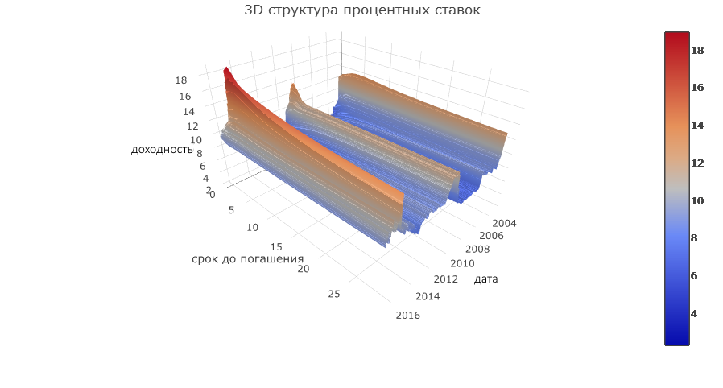

```{r, include=FALSE}
library("memisc")
library("lmtest")
library("ggplot2")
library("dplyr")
library("foreign")
library("vcd")
library("devtools")
library("hexbin")
library("pander")
library("sjPlot")
library("knitr")
library("reshape")
library("psych")
library("tidyr")
setwd("~/GitHub/MyProjects/RProjects/GCurveStatistics")

source("clean.R")
source("data_for_project.R")
opts_chunk$set(echo = FALSE, message = FALSE, fig.width = 10, fig.height = 7)
```

### Введение

Временная  структура  процентных  ставок –это  последовательность значений  процентных  ставок,  упорядоченная  по  сроку  погашения  в определенный момент времени. Это функция процентной ставки по займу от времени  до  погашения,  графическую  презентацию  которой  называют кривой доходности.

В ходе работы был проведен анализ структуры процентных ставок по государственным облигациям с нулевым купоном - разновидность облигации (bond), по которой не предусматривается выплата процентов.  

Данные по доходности бескупонных облигации в свободном доступе и могут быть получены на [сайте Центрального банка Россииской Федерации](http://www.cbr.ru/gcurve/GDB.asp). Именно они и были использованы в качестве основных данных для исследования.    

### Терминология

Банк России дает следующий список используемых терминов с их определениями, которыми мы тоже будем пользоваться в ходе работы:

_Бескупонная доходность_ - доходность к погашению дисконтной облигации.  
_Кривая бескупонной доходности_ (zero-coupon yield curve) - совокупность
бескупонных доходностей для различных сроков до погашения облигаций.   
_Кривая бескупонной доходности по государственным ценным бумагам (G-кривая)_ -
кривая бескупонной доходности, определенная на основании сделок с облигациями на
рынке государственных краткосрочных бескупонных облигаций (ГКО) и облигаций
федеральных займов (ОФЗ).   
_Изотермный ряд_ – временной ряд бескупонных доходностей с заданным сроком до
погашения облигаций.   
_Доходность сделки_ - доходность к погашению, соответствующая цене
определенной сделки с облигациями и рассчитанная в порядке, установленном на рынке
ГКО-ОФЗ.  
_Расчетная цена_ - цена облигации, рассчитанная по кривой бескупонной
доходности как сумма дисконтированных выплат по данной облигации.  
_Расчетная доходность_ - доходность к погашению, соответствующая расчетной
цене данной облигации.  
_База расчета_ - список выпусков облигаций (ГКО-ОФЗ), используемых при расчете
G-кривой.  
_Ретроспективный период_ - период между предыдущей и текущей датами
пересмотра базы расчета/численных параметров модели G-кривой.
Базисный пункт - единица измерения доходности, равная одной сотой процента
(0,01%).    

### Постановка цели и задач

Цель работы - провести описательные характеристики эмпирической структуры процентных ставок государственных бескупонных облигаций. Для достижения поставленной цели были получены данные по доходности облигаций с разным сроком погашения с 4 января 2003 по 3 июня 2016.

Перед работой ставятся следующие задачи:

Провести описательные статистики по бумагам с разным сроком погашения, охарактеризовать их изотермные ряды по доходностям.Для этого нужно проверить гипотезу о нормальности распределения, выделить тренды.

Построить кривые доходностей в разное время, охарактеризовать наблюдаемые эффекты, провести сравнительные характеристики.Так же проверить гипотезу о зависимости доходности от срока до погашения

Воспользоваться одной из моделей параметрических оценок кривых доходностей для сравнения характеризационных свойств кривых доходностей в разные моменты времени. Описать полученные результаты

Сделать выводы

### Описание данных

База процентных ставок содержит в себе информацию с 4 января 2003 года и по текущий момент. Данные представляют собой рассчитанные значения облигации с разным сроком погашения (от 1 до 30 лет) в определенную дату. Расчет доходности осуществляется ЗАО ММВБ в режиме реального времени по сделкам и заявкам на рынке государственных ценных бумаг. В основе методологии лежит параметрическая модель Нельсона-Сигеля с добавлением слагаемых, обеспечивающих дополнительные степени свободы и как следствие более точную подгонку кривой к данным торгов.Теоретическая доходность к погашению каждого выпуска ОФЗ, включенного в базу расчета, равняется сумме доходности к погашению, рассчитанной на основе G-кривой, и корректирующей поправки. Часть выпусков назначается опорными выпусками ("бенчмарками"), к ним G-кривая подстраивается без корректирующих поправок.

Кривая бескупонной доходности представляет собой общепринятый способ описания временной структуры процентных ставок для однородных финансовых инструментов с одинаковыми качественными характеристиками, в том числе сходного кредитного качества. Данный инструмент широко используется в аналитических целях центральными и коммерческими банками, а также финансовыми компаниями. Кривая бескупонной доходности по государственным ценным бумагам является одним из главных индикаторов состояния финансового рынка и базовым эталоном для оценки различных облигаций и иных финансовых инструментов.

Более подробно о [методике расчета](http://www.cbr.ru/gcurve/Mthodics.pdf) и построения [кривои бескупоннои доходности](http://www.cbr.ru/gcurve/gko_yieldcurve_rcb_3_2006.pdf) по государственным ценным бумагам можно прочитать на сайте банка России.

### Описательные статистики бумаг с разным сроком погашения

Прежде всего опишем данные, разбив на группы по доходности погашения. В работе будем рассматривать лишь данные по срокам погашения в 1 год, 2 года, 5 лет и 30 лет, полную статистику см. в приложении 3:

срок до погашения | 1 год | 2 года | 5 лет | 15 лет | 30 лет
------------------|-------|--------|-------|--------|--------
минимальное значение|`r min(df$years_01)` | `r min(df$years_02)`|`r min(df$years_05)` | `r min(df$years_15)`|`r min(df$years_30)` 
максимальное значение|`r max(df$years_01)` | `r max(df$years_02)`|`r max(df$years_05)` | `r max(df$years_15)`|`r max(df$years_30)` 
среднее значение  |`r mean(df$years_01)` | `r mean(df$years_02)`|`r mean(df$years_05)` | `r mean(df$years_15)`|`r mean(df$years_30)` 
медиана           |`r median(df$years_01)`|`r median(df$years_02)`|`r median(df$years_05)` | `r median(df$years_15)`|`r median(df$years_30)`
средне кв. отклонение|`r sd(df$years_01)`|`r sd(df$years_02)`|`r sd(df$years_05)` | `r sd(df$years_15)`|`r sd(df$years_30)`

И проведем `r st_1$method` на нормальность и построим гистограммы, более подробно см. приложение 2:

```{r}
ggplot(df1_few,aes(value))+
  geom_histogram(fill="white", col="black", binwidth=0.4)+
  facet_wrap(~ variable)
```  

срок до погашения | 1 год | 2 года | 5 лет | 15 лет | 30 лет
------------------|-------|--------|-------|--------|--------
W статистика|`r st_1$statistic` | `r st_2$statistic`|`r st_5$statistic` | `r st_15$statistic`|`r st_30$statistic` 
p значение < 0.01|`r st_1$p.value < 0.01` | `r st_2$p.value< 0.01`|`r st_5$p.value< 0.01` | `r st_15$p.value< 0.01`|`r st_30$p.value< 0.01` 

Для наглядности построим графики отклонения от среднего для всех бумаг в зависимости от срока погашения:

```{r, echo=FALSE}
boxplot(value ~ variable,
        xlab = "срок до погашения",
        ylab = "доходность",
        main="Распределение процентной ставки",
        names=c(1:30),
        col = "coral", data = df1)
```


Если же мы построим трехмерный график модели, где по горизонтальным осям будут дата подсчета ставки и срок до погашения, а по вертикали процентная ставка:



Рассмотрим изотермный ряд

```{r}
ggplot(data = df1, aes(x = Date, y = value)) +
  geom_line(aes(colour = variable))+
  xlab("дата  ")+
  ylab("доходность") +
  labs(colour="")
```

```{r}
ggplot(data = df1_few, aes(x = Date, y = value)) +
  geom_line() + 
  facet_wrap(~ variable)+
  stat_smooth(method="lm",fullrange=TRUE, se=FALSE)+
  ggtitle("Временные колебания процентных ставок") + 
  xlab("дата  ")+
  ylab("доходность")
```

Из графиков можно заметить общее движение кривых для разных сроков погашения, так же у краткосрочных бумаг более резкие перепады и более значимые скачки.

### Кривые доходностей

Рассмотрим временную структуру кривых доходности. Кривые доходности более заметно отличаются при меньшем сроке погашения, это хорошо видно на примере графиков доходности с разницей приблизительно в 1 год:

```{r}
ggplot(data = df_trans1_year, aes(x = years, y = value)) +
  geom_line(aes(colour = variable))+
  ggtitle("Кривые доходностеи с 2003 по 2016")+
  xlab("срок погашения")+
  ylab("доходность")+
  labs(colour="")
```

Типичной  формой  кривой  доходности  является  монотонно  восходящая линия,  которая  характерна  для  большинства  развитых  стран  в  периоды стабильной  макроэкономической  ситуации  или  роста.  Такую  кривую  часто называют  нормальной  кривой  доходности. Однако это не всегда так, согласно имеющимся данным кривая доходности хоть и имеет прямые концы, но может принимать произвольную форму.

Особенно хорошо видно резкое изменение доходности на рисунке "3D структура процентных ставок" в периоды кризисов 2008-2009 и 2014-2016 годов, в связи с этим акцентируем свое внимание именно на этих периодах: с сентября 2008 по сентябрь 2009 и с апреля 2014 по июнь 2016:

```{r}
ggplot(data = df_trans1_few2008, aes(x = years, y = value)) +
  geom_line(aes(colour = variable))+
  ggtitle("Кривые доходностеи с 2008 по 2009")+
  xlab("срок погашения")+
  ylab("доходность")+
  labs(colour="")
ggplot(data = df_trans1_few2014, aes(x = years, y = value)) +
  geom_line(aes(colour = variable))+
  ggtitle("Кривые доходностеи с 2014 по 2016")+
  xlab("срок погашения")+
  ylab("доходность")+
  labs(colour="")
```

Проведем тест `r kt$method` для проверки того отличается ли доходность бумаг с разным сроком погашения. Нулевая гипотеза - доходность от срока не зависит.

```{r}
kt
```

Из полученного результата можем смело отклонить эту гипотезу

### Параметрическая оценка коэффициентов уровня, наклона и кривизны кривых доходности

Существует множество моделей по оценке структуры процентных ставок на основе рыночных данных. Одной из таких моделей является модель Нельсона-Сигеля и различные ее усложнения. Эта модель хорошо зарекомендовала себя на рынках как развитых, так и развивающихся стран. Банк России строит кривую доходности так же основываясь на вариации модели Нельсна и Сигеля. Мы же по имеющимся данным попробуем найти коэффициенты кривых доходности обычной модели. Diebold и Li показали[](Diebold F.X., Li C. (2006) Forecasting the Term Structure of Government Bond Yields. Journal of Econometrics, 130, pp. 337–364.), что коэффициенты могут интерпретироваться как компоненты, отвечающие за кратко-, средне- и долгосрочную динамику $y(\tau)=\beta_1 + \beta_2(\frac{1-e^{-\lambda \tau}}{\lambda \tau}) + \beta_3(\frac{1-e^{-\lambda \tau}}{\lambda \tau} - e^{-\lambda \tau})$. Параметр $\tau$ обычно считают постоянным, его берут равным величине, при которой достигается максимум коэффициента при $\beta_2$ при сроке 2-3 года.В соответствии с данным подходом примем $\tau$ равным `r lambda` и рассчитаем коэффициенты $\beta_1, \beta_2, \beta_3$ в каждый момент времени с помощью метода наименьших квадратов, построив график зависимости значения коэффициента от времени.  

```{r}
ggplot(data = beta_hat1, aes(x=Date,y=value)) +
  geom_point(aes(colour=variable), size=1)+
  ggtitle("Коэффициенты модели Нельсона-Сигеля")+
  xlab("дата")+
  ylab("значение")+
  labs(colour="")+
  coord_cartesian(ylim = c(-10, 15))+
  theme(axis.ticks = element_blank(), axis.text.x = element_blank())
```

Согласно построенному графику видно, что долгосрочная компонента - коэффициент $\beta_1$ все время держится в районе 10%, а вот краткосрочная - $\beta_3$ и среднесрочная - $\beta_2$ компаненты колеблются довольно произвольно, могут быть как положительными, так и отрицательными.

### Заключение

В рамках проекта удалось с разных сторон рассмотреть структуру бескупонных государственных бумаг, их доходности, изотермные ряды, рассмотреть кривые доходности и их изменения с 2003 года.

Результаты проведенной работы говорят об отсутствии нормальности в распределении доходностей бумаг с разным сроком погашения. Так же было получено, что существует зависимость между доходностью облигации от срока погашения. Согласно полученным результатам оценки модели Нельсона-Сигеля кривые доходностей имеют схожую долгосрочную компоненту, но другие параметры могут значительно различаться.

-----------------

### Приложение 1. Временные колебания процентных ставок 

```{r, echo=FALSE, fig.height=10}
ggplot(data = df1, aes(x = Date, y = value)) +
  geom_line() + 
  facet_wrap(~ variable)+
  stat_smooth(method="lm",fullrange=TRUE, se=FALSE)+
  #ggtitle("Временные колебания процентных ставок") + 
  xlab("дата")+
  ylab("доходность")+
  theme(axis.ticks = element_blank(), axis.text.x = element_blank())
```

### Приложение 2. Распределение доходностеи

```{r}
ggplot(df1,aes(value))+
  geom_histogram(fill="white", col="black", binwidth=0.4)+
  facet_wrap(~ variable)+
  #ggtitle("Распределение доходностеи") + 
  xlab("доходность")+
  ylab("количество")
```  

### Приложение 3. Описательные статистики

```{r,echo=FALSE,results='hold'}
summary(df[c(2:31)])

```


